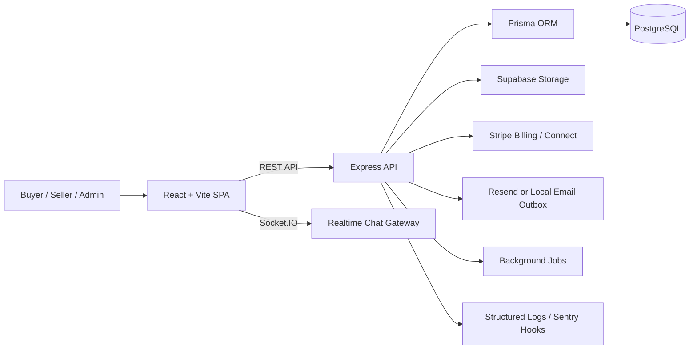
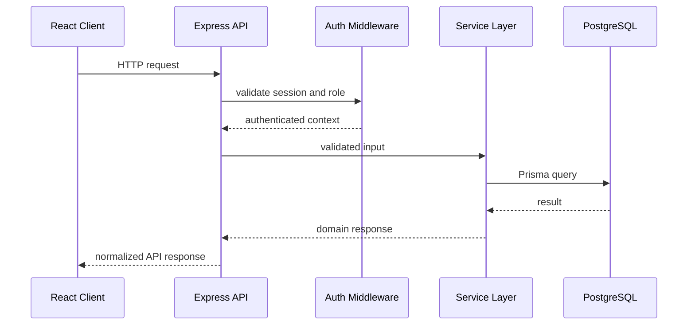

# OrbitList - Social Profile Marketplace

OrbitList is a full-stack marketplace for buying, selling, verifying, and managing social media assets such as YouTube channels, Instagram pages, X accounts, TikTok profiles, Telegram communities, and other audience-backed digital properties.

The project is built as a real marketplace product, not just a CRUD demo. It includes public discovery, seller inventory management, buyer-seller messaging, listing verification, identity workflows, billing hooks, protected transaction tracking, admin moderation, audit logging, storage integration, and deployment-ready configuration.

> Repository package name: `social-profile-marketplace`  
> Product name used across the app: `OrbitList`

---

## Table of Contents

- [Why This Project Exists](#why-this-project-exists)
- [Product Summary](#product-summary)
- [Core Features](#core-features)
- [User Roles](#user-roles)
- [Tech Stack](#tech-stack)
- [High-Level Architecture](#high-level-architecture)
- [Repository Structure](#repository-structure)
- [Database and Domain Model](#database-and-domain-model)
- [Authentication and Security](#authentication-and-security)
- [Realtime Messaging](#realtime-messaging)
- [Payments, Payouts, and Trust Flow](#payments-payouts-and-trust-flow)
- [Admin and Moderation](#admin-and-moderation)
- [Environment Variables](#environment-variables)
- [Local Development](#local-development)
- [Database Setup](#database-setup)
- [Testing and Build](#testing-and-build)
- [Deployment](#deployment)
- [Smoke Test Checklist](#smoke-test-checklist)
- [Roadmap](#roadmap)
- [Interview Talking Points](#interview-talking-points)

---

## Why This Project Exists

Buying or selling a social media profile is not the same as buying a normal product. A buyer needs proof that the account exists, that the audience metrics are real, that the seller can transfer ownership, and that there is a clear record of communication and transaction state.

OrbitList solves this by combining:

- marketplace discovery
- seller onboarding
- listing and identity verification
- proof uploads
- buyer-seller messaging
- transaction tracking
- dispute-ready workflows
- admin moderation
- audit logging

The goal is to model how a serious trust-based digital asset marketplace should work.

---

## Product Summary

OrbitList lets sellers list social media assets and lets buyers discover, evaluate, save, message, and initiate purchase workflows around those listings.

Sellers can manage inventory, submit proof, request listing verification, upgrade visibility, and track performance signals. Buyers can browse marketplace listings, save assets to a watchlist, message sellers, and follow transaction progress. Admins can review listings, identity requests, reports, disputes, payments, and audit history.

The system is designed around three major concerns:

- **Discovery**: buyers need clean marketplace search and listing detail pages.
- **Trust**: buyers need proof, verification, reports, moderation, and identity signals.
- **Operations**: admins need review queues, audit logs, transaction visibility, and dispute workflows.

---

## Core Features

### Marketplace

- Public marketplace for social profile listings.
- Listing detail pages with platform, niche, pricing, metrics, media, and transfer context.
- Platform support for Instagram, YouTube, X, TikTok, Telegram, and similar social assets.
- Buyer watchlist for saving interesting listings.
- Featured listing and billing-ready structure.

### Seller Workspace

- Seller dashboard with listing inventory overview.
- Create, edit, and submit listings.
- Upload proof/media for listings and identity verification.
- Listing status flow for draft, review, approval, rejection, and live marketplace visibility.
- Seller readiness checklist and profile completion flow.

### Buyer Experience

- Marketplace discovery and listing inspection.
- Watchlist support.
- Buyer-seller conversations.
- Transaction and protected handoff tracking.
- Notification feed for marketplace activity.

### Messaging

- Buyer-seller conversation threads.
- Persistent message history.
- Socket.IO powered realtime updates.
- Typing indicators.
- Unread message counts.

### Trust and Safety

- Ownership proof uploads.
- Listing verification requests.
- Identity verification workflow.
- User reports for suspicious listings or users.
- Admin approval and rejection workflows.
- Audit logs for critical actions.

### Payments and Monetization

- Stripe-ready billing architecture.
- Subscription and featured listing payment records.
- Checkout session flow hooks.
- Webhook handling structure.
- Seller payout onboarding structure with connected account support.
- Transaction records for buyer-seller purchase lifecycle.

### Admin Operations

- Listing review.
- Verification review.
- Identity review.
- Payment visibility.
- Report handling.
- Dispute case management.
- Audit log inspection.

---

## User Roles

### Buyer

Buyers browse listings, save assets, message sellers, start transactions, and report suspicious activity.

### Seller

Sellers create listings, upload proof, manage inventory, communicate with buyers, and complete readiness steps for a trustworthy profile.

### Admin

Admins moderate the marketplace by reviewing listings, verification requests, identity submissions, reports, disputes, payments, and audit logs.

---

## Tech Stack

### Frontend

- React
- Vite
- TypeScript
- React Router
- TanStack Query
- Tailwind CSS
- shadcn-style reusable UI primitives
- Zustand
- Socket.IO Client
- Lucide React

### Backend

- Node.js
- Express.js
- TypeScript
- Prisma ORM
- PostgreSQL
- Socket.IO
- Zod validation
- Stripe SDK
- Sentry hooks

### Infrastructure and Services

- PostgreSQL database
- Supabase Storage for uploads
- Stripe for billing, checkout, and payout-ready flows
- Resend-ready email delivery with local outbox fallback
- Render for backend deployment
- Vercel for frontend deployment

### Security and Reliability

- HTTP-only cookie based auth
- Access and refresh session flow
- CORS allowlist
- Helmet security headers
- Rate limiting for auth, messaging, and uploads
- Request size limits
- File validation for uploads
- Structured logs
- Health checks
- Background job scripts

---

## High-Level Architecture



### Request Flow



---

## Repository Structure

```text
social-profile-marketplace/
|-- client/                 # React frontend
|   |-- src/
|   |   |-- app/            # providers, layouts, router
|   |   |-- components/     # common UI and shared components
|   |   |-- features/       # feature-level frontend modules
|   |   |-- pages/          # route pages
|   |   |-- services/       # API clients
|   |   |-- styles/         # global theme entry
|   |   `-- types/          # frontend types
|   `-- vercel.json         # Vercel SPA rewrites
|-- server/                 # Express backend
|   |-- prisma/             # schema, migrations, seed data
|   |-- scripts/            # local database scripts
|   |-- src/
|   |   |-- config/         # env, Stripe, storage, monitoring
|   |   |-- core/           # app, routes, server bootstrap
|   |   |-- jobs/           # cleanup, reminders, backup jobs
|   |   |-- middlewares/    # auth, validation, rate limits
|   |   |-- modules/        # domain modules
|   |   `-- utils/          # shared backend utilities
|   `-- tests/              # backend API tests
|-- shared/                 # shared workspace package
|-- docs/                   # architecture, API, deployment, operations docs
|-- render.yaml             # Render backend blueprint
|-- package.json            # npm workspaces
`-- README.md
```

---

## Database and Domain Model

The database is designed around marketplace operations, not isolated tables.

### Identity and Access

- `User`: account profile, role, notification preferences, verification status, Stripe account fields.
- `RefreshSession`: revocable refresh sessions for cookie-based auth.

### Marketplace Catalog

- `Platform`: supported social platforms.
- `Niche`: content categories.
- `Listing`: saleable social asset with price, status, seller, slug, and transfer metadata.
- `ListingMetric`: audience and performance metrics.
- `ListingMedia`: listing images and supporting files.
- `Favorite`: buyer watchlist item.
- `Inquiry`: buyer interest record.

### Messaging

- `Conversation`: buyer-seller thread linked to a listing.
- `Message`: persisted chat message.

### Trust and Moderation

- `VerificationRequest`: listing verification workflow.
- `IdentityVerification`: identity/KYC-style submission.
- `Report`: suspicious listing or user report.
- `AuditLog`: durable history of sensitive actions.
- `Notification`: in-app notification feed.

### Monetization

- `Plan`: seller subscription tier.
- `Subscription`: user's active or historical plan.
- `Payment`: billing, featured listing, checkout, and transaction payment records.

### Transactions and Disputes

- `Transaction`: buyer-seller deal lifecycle.
- `Dispute`: issue opened during a transaction.
- `DisputeEvidence`: uploaded evidence or supporting notes.
- `DisputeCaseEvent`: timeline of dispute actions.

---

## Authentication and Security

OrbitList uses a cookie-based authentication model with refresh-session support.

Key security decisions:

- HTTP-only cookies for auth instead of exposing tokens directly to JavaScript.
- Access token TTL configuration.
- Refresh session TTL configuration.
- Revocable refresh sessions stored in the database.
- CORS restricted to configured frontend origins.
- `helmet` for HTTP security headers.
- Rate limits for auth, messaging, and uploads.
- JSON body size limits.
- File upload validation for supported file types.
- Protected route and role-based backend authorization.

This gives the project a more production-like auth model than a simple localStorage JWT flow.

---

## Realtime Messaging

Messaging uses a hybrid model:

- REST APIs persist conversations and messages.
- Socket.IO broadcasts live message events.
- Typing indicators are sent over sockets.
- The frontend keeps conversation caches in sync with TanStack Query.

This keeps the system reliable because chat history is stored in the database while live updates improve UX.

---

## Payments, Payouts, and Trust Flow

OrbitList includes the structure for marketplace monetization and transaction safety.

Implemented or prepared flows include:

- seller subscription plans
- featured listing billing
- Stripe checkout session integration
- webhook-based confirmation handling
- payment history tracking
- seller payout onboarding model
- transaction records
- handoff and review workflow
- dispute case model

### Escrow-Style Flow Concept

The project models the shape of an escrow-style purchase flow:

1. Buyer starts a transaction.
2. Payment is created and tracked.
3. Seller provides transfer/handoff proof.
4. Buyer reviews the handoff.
5. Platform records completion or dispute state.
6. Admin can review disputed cases.

Full legal escrow requires a regulated payment setup. OrbitList keeps the product architecture ready for that kind of protected transaction workflow.

---

## Admin and Moderation

Admin routes exist for operational control:

- `/admin/listings`
- `/admin/verifications`
- `/admin/identity`
- `/admin/payments`
- `/admin/reports`
- `/admin/disputes`
- `/admin/audit-logs`

Admin capabilities include:

- approve or reject listings
- review verification requests
- review identity packets
- inspect payment records
- process reports
- manage dispute cases
- review audit history

---

## Environment Variables

The app uses separate frontend and backend environment files.

### Client

Create `client/.env`:

```env
VITE_API_BASE_URL=http://localhost:4000/api
VITE_SOCKET_URL=http://localhost:4000
```

For production:

```env
VITE_API_BASE_URL=https://your-api-domain/api
VITE_SOCKET_URL=https://your-api-domain
```

### Server

Create `server/.env` from `server/.env.example`.

Important groups:

- `DATABASE_URL`
- `JWT_SECRET`
- `CLIENT_URL`
- `ALLOWED_CORS_ORIGINS`
- `AUTH_COOKIE_SECURE`
- `AUTH_COOKIE_SAME_SITE`
- `SUPABASE_URL`
- `SUPABASE_SERVICE_ROLE_KEY`
- `SUPABASE_STORAGE_BUCKET`
- `STRIPE_SECRET_KEY`
- `STRIPE_WEBHOOK_SECRET`
- `RESEND_API_KEY`
- `SENTRY_DSN`

For local development, Stripe, Resend, and Sentry can be left blank if you are not testing those integrations. Uploads require storage configuration when using production storage.

---

## Local Development

### Prerequisites

- Node.js
- npm
- PostgreSQL or the included local PostgreSQL scripts

### Install Dependencies

```bash
npm install
```

### Start Both Apps

```bash
npm run dev
```

This starts:

- frontend on Vite
- backend on Express

### Start Separately

```bash
npm run dev:client
npm run dev:server
```

---

## Database Setup

### Start Local PostgreSQL

```bash
npm run db:start --workspace server
```

### Generate Prisma Client

```bash
npm run prisma:generate --workspace server
```

### Run Migrations

For local development:

```bash
npm run prisma:migrate --workspace server
```

For deployed/staging/prod database:

```bash
npm exec --workspace server prisma migrate deploy
```

### Seed Demo Data

```bash
npm run prisma:seed --workspace server
```

Seed data includes platforms, niches, plans, users, listings, metrics, and sample marketplace content.

### Demo Accounts

```text
seller@orbitlist.dev / Orbitlist123!
buyer@orbitlist.dev  / Orbitlist123!
admin@orbitlist.dev  / Orbitlist123!
```

---

## Testing and Build

### Client Tests

```bash
npm run test --workspace client
```

### Server Tests

```bash
npm run test --workspace server
```

### Type Check and Build

```bash
npm run build
```

### Lint / Type Validation

```bash
npm run lint
```

---

## Deployment

OrbitList is designed for split deployment:

- Frontend: Vercel
- Backend: Render
- Database: managed PostgreSQL
- Uploads: Supabase Storage

### Frontend on Vercel

Recommended Vercel settings:

- Root directory: `client`
- Build command: `npm run build`
- Output directory: `dist`
- Install command: `npm install`

Required Vercel env:

```env
VITE_API_BASE_URL=https://your-render-api-domain/api
VITE_SOCKET_URL=https://your-render-api-domain
```

`client/vercel.json` handles SPA rewrites so React Router deep links work.

### Backend on Render

Recommended Render settings:

```bash
npm ci --include=dev && npm run prisma:generate --workspace server && npm run build --workspace server
```

Pre-deploy command:

```bash
npm exec --workspace server prisma migrate deploy
```

Start command:

```bash
npm run start --workspace server
```

Health check:

```text
/api/health
```

Production cookie settings when frontend and backend are on different domains:

```env
AUTH_COOKIE_SECURE=true
AUTH_COOKIE_SAME_SITE=none
CLIENT_URL=https://your-frontend-domain
ALLOWED_CORS_ORIGINS=https://your-frontend-domain
```

---

## Smoke Test Checklist

After deployment, test these flows manually:

- health endpoint returns success
- signup
- login
- logout
- marketplace loads
- listing detail page opens
- seller creates listing
- listing proof upload works
- seller submits listing for review
- buyer saves listing to watchlist
- buyer starts conversation
- realtime messaging works
- notifications page loads
- settings page updates profile
- identity verification form validates input
- admin listing review works
- reports and disputes pages load
- protected pages redirect when logged out

---

## Roadmap

Future improvements planned for a stronger production product:

- Full Stripe payment capture flow for buyer-seller transactions.
- Regulated escrow or escrow-like protected handoff integration.
- Stronger KYC provider integration for identity verification.
- Seller reputation and public trust history.
- Advanced marketplace search, filtering, and sorting.
- Seller analytics dashboard.
- Email notification automation through Resend.
- Background workers for retries, cleanup, reminders, and stale moderation queues.
- CI/CD expansion with full test gates.
- Monitoring dashboards and alerting.
- Mobile-first UX polish and performance tuning.

---

## Interview Talking Points

OrbitList is useful in interviews because it demonstrates more than frontend pages.

Strong points to explain:

- Designed a marketplace around trust, verification, messaging, payments, and moderation.
- Built a modular Express backend with Prisma, PostgreSQL, Zod validation, and role-based access.
- Implemented cookie-based auth with refresh-session support instead of localStorage tokens.
- Added realtime buyer-seller messaging with Socket.IO while keeping messages persisted through REST APIs.
- Modeled transaction, dispute, audit, report, verification, and payment entities for marketplace operations.
- Prepared deployment architecture using Vercel, Render, managed PostgreSQL, Supabase Storage, and Stripe-ready flows.
- Added admin workflows for reviewing listings, identity packets, reports, disputes, payments, and audit logs.

---

## Resume Summary

**OrbitList** - React.js, Vite, Tailwind CSS, Express.js, PostgreSQL, Prisma, Socket.IO, Stripe, Supabase Storage, Render, Vercel

- Built a full-stack marketplace for buying and selling social media assets such as Instagram pages, YouTube channels, X accounts, TikTok profiles, and Telegram communities.
- Developed secure buyer, seller, and admin workflows including authentication, listings, watchlists, messaging, notifications, billing, and dashboard management.
- Implemented trust-focused systems such as ownership proof uploads, identity verification, listing moderation, report handling, dispute workflows, and audit logs.
- Designed a modular backend using Express, Prisma, PostgreSQL, Zod, Socket.IO, and REST APIs with deployment-ready environment configuration.
- Structured the product for future scale with Stripe payments, seller payout onboarding, protected handoff flows, seller reputation, analytics, and email automation.

---

## Documentation

- [Architecture](docs/architecture.md)
- [API Spec](docs/api-spec.md)
- [Database Schema](docs/database-schema.md)
- [Deployment Guide](docs/deployment.md)
- [Operations Guide](docs/operations.md)
- [Sitemap](docs/sitemap.md)
